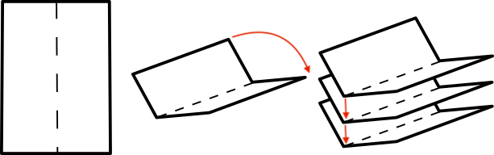

# 📅 Foldable Daybook

Generate your own foldable calendar that sits perfectly between you and your laptop! Perfect for the analog note-taker in a digital world.

## 🎯 What it does

This Python tool creates a printable PDF calendar that you can fold into a compact, portable planner. Keep track of meetings, deadlines, and random thoughts without switching screens or hunting for your phone. The clever folding design shows one week at a time, helping you stay focused on current tasks without getting overwhelmed by the entire month.

## 🚀 Quick Start

### Prerequisites
- [Docker](https://www.docker.com/) (installation required)
- Printer (yes, the one collecting dust in the corner)
- Basic folding skills (origami masters welcome!)

### 1. Docker Setup
* Clone the Foldable Daybook repository.
* Opena a terminal and navigate to the `dockerfile` folder and build the Docker image:

```bash
docker build -t foldable-daybook .
```

### 2. Generate Calendar
* Run the calendar generator:
⚠️ **Note:** Update file paths to match your local **foldable-daybook** folder.

```bash
docker run --rm \
  -v /path/to/foldable-daybook:/home \
  foldable-daybook bash make_calendar.sh
```

### 3. Print and Fold
* Navigate to the output folder
* Print the generated PDF file
* Follow the folding guidelines in the included instructions
* Place under your laptop and start planning!




## ⚙️ Configure Your Calendar 
* Navigate to `data/inputs/config.json`
* Edit the configuration file with your preferences:

```json
{
    "start_date": "10.02.2025",
    "nb_weeks": 52
}
```

**Important Notes:**
- `start_date`: Should be the Monday of your first week (DD.MM.YYYY format)
  - ⚠️ If you input any other day, weeks will run for 5 days from that day
  - Example: Starting on Wednesday = Wednesday to Sunday weeks
- `nb_weeks`: Number of weeks to generate
  - ⚠️ If you input an odd number, an extra week will be added
  - Two weeks are printed per page, so we keep it even!

## 🎨 Features

- Clean, minimalist design
- Perfectly sized for laptop-side placement
- Easy to print and fold
- Space for daily notes
- No batteries required! 🔋


## 🙏 Acknowledgments

This project is inspired by the [Cortex Brand Sidekick Calendar Companion](https://cottonbureau.com/p/JJGBJR/journal/sidekick-calendar-companion#/19301969/black-paper-12x7). While this is a DIY, customizable free alternative, if you're looking for a premium, professionally crafted solution, definitely check out their original product!

## 📝 Contributing

Got ideas for making this even better? PRs are welcome! Whether it's adding new features and improving the design.
